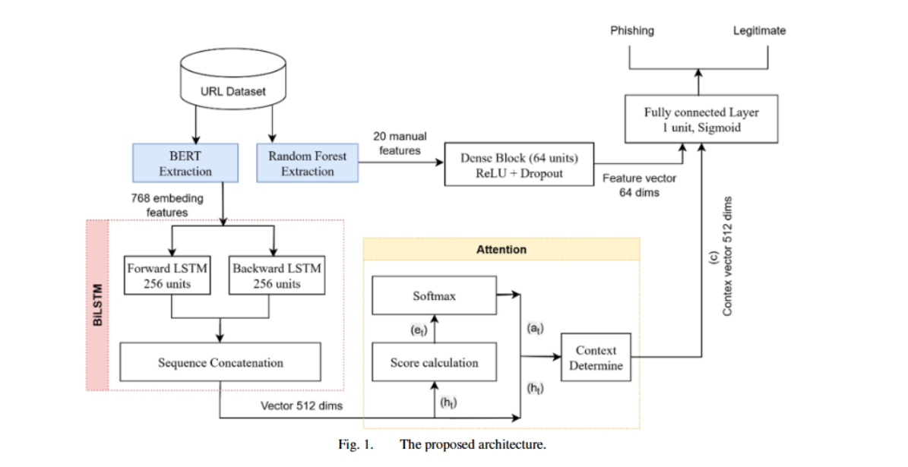

#  QRGuard

QRGuard is an AI-powered web application that detects whether a QR Code redirects users to a **phishing website** or a **legitimate destination**.

Users can upload or scan QR Codes and instantly receive security analysis before opening the target link.

---

# Features

- QR Code scanning
- URL extraction
- AI phishing detection
- Real-time prediction
- Risk analysis result
- Web-based access

---

# Methodology

QRGuard uses a **hybrid phishing URL detection architecture** combining semantic understanding and structural URL analysis.

The system extracts both contextual meaning from URLs and manually engineered URL characteristics to improve phishing detection performance.

---

## Architecture



---

## Detection Pipeline

```text
QR Code
   ↓
Decode QR Content
   ↓
Extract URL
   ↓
┌──────────────────────┐
│ Feature Extraction   │
├──────────────────────┤
│ • Semantic Embedding │
│   (BERT Encoder)     │
│                      │
│ • Manual Features    │
│   (URL Length,       │
│   Entropy, Query,    │
│   Symbols, Digits)   │
└──────────┬───────────┘
           ↓
      BiLSTM Layer
           ↓
     Attention Layer
           ↓
      Dense Block
           ↓
 Binary Classification
(SAFE / PHISHING)
```

---

## Model Components

### 1. QR Decoding

The QR image is decoded into raw content.

If the content contains a URL, it is forwarded into the phishing analysis pipeline.

---

### 2. Semantic Feature Extraction (BERT)

URLs are transformed into semantic vector embeddings using a pretrained BERT model.

This enables the system to understand hidden contextual relationships and phishing patterns.

---

### 3. Manual Feature Extraction

Additional handcrafted features are extracted from the URL:

- URL Length
- Number of Digits
- Number of Special Characters
- Path Length
- Query Parameters
- Entropy Score
- Symbol Frequency

---

### 4. BiLSTM + Attention

BiLSTM captures bidirectional dependencies inside URL sequences.

Attention highlights suspicious segments that contribute most to phishing detection.

---

### 5. Classification

The final feature representation is passed into a dense neural network.

Output:

```text
SAFE 
or
DANGEROUS 
```

---

## Validation Result

The validation result represents performance on data from the same distribution as the training dataset.

| Metric | Value |
|---|---:|
| Validation Accuracy | 97.98% |
| Validation Precision | 96.47% |
| Validation Recall | 96.43% |
| Validation F1-score | 96.45% |

The validation result shows that the model performs strongly when evaluated on data with a similar distribution to the training dataset.

## External Test Result

The external test result represents performance on unseen URL datasets with different distributions.

| Metric | Value |
|---|---:|
| Accuracy | 87.72% |
| Precision | 77.99% |
| Recall | 85.06% |
| F1-score | 81.37% |

---

#  Tech Stack

| Layer      | Technology                |
| ---------- | ------------------------- |
| Frontend   | Next.js                   |
| Backend    | Django / FastAPI          |
| AI Model   | BERT + BiLSTM + Attention |
| Database   | PostgreSQL                |
| Deployment | Vercel                    |

---

#  Installation

Clone repository:

```bash
git clone https://github.com/your-username/QRGuard.git
```

Install dependencies:

```bash
npm install
```

Run project:

```bash
npm start
```

Open:

```text
http://localhost:3000
```

---

# Team

Hackathon Team — QRGuard
Muhammad Rasyid Bomantoro Setya Putra - AI Engineer
I Putu Sukma Widyantara - Fullstack Developer
Muhammad Trinanda Thoriq - Fullstack Developer
---
